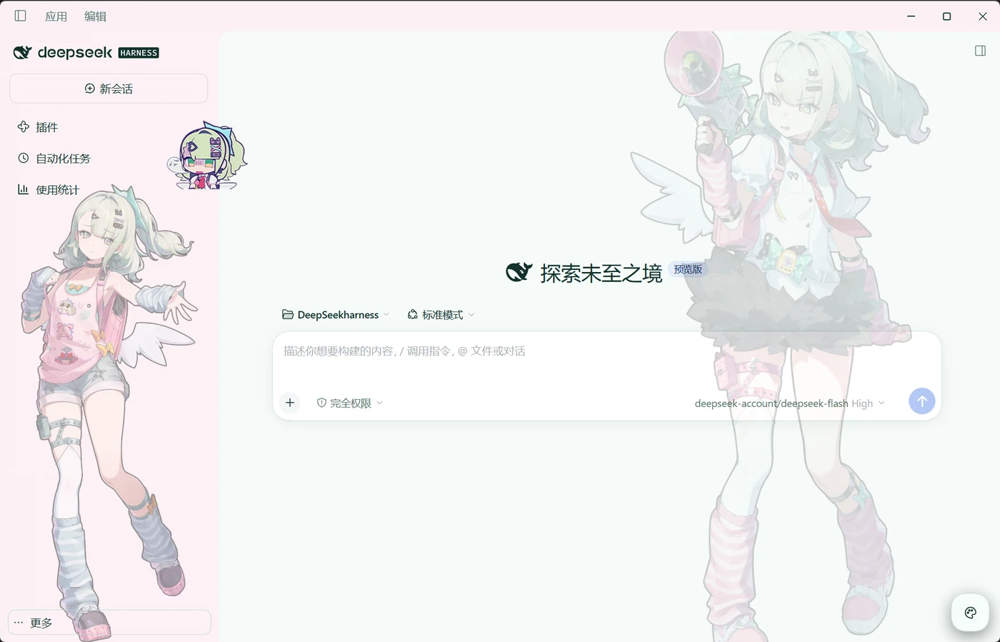
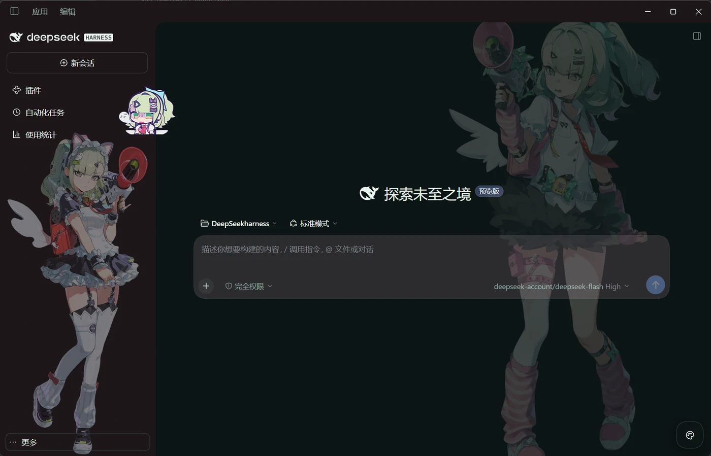
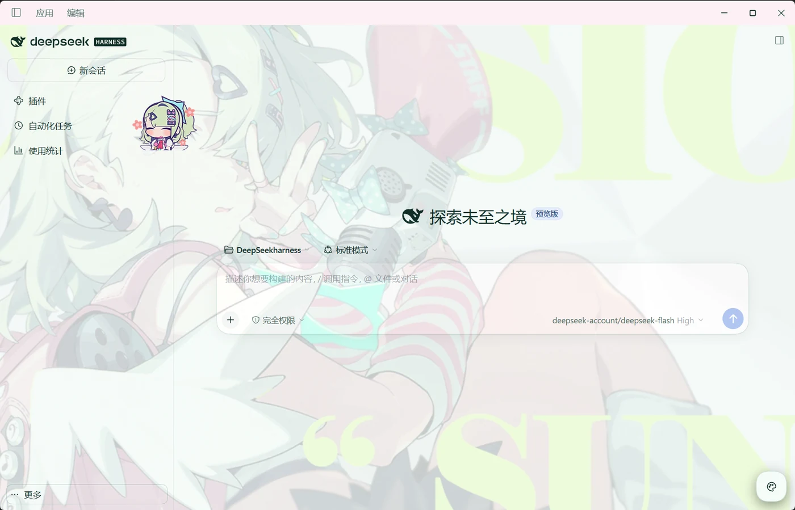
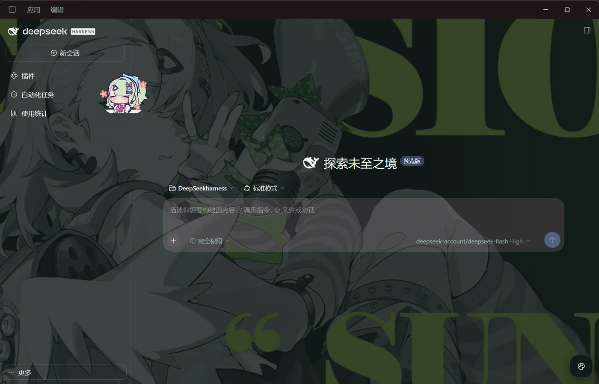

# dsh-ui-zzz-sunna

给 dsh 客户端换上一套《绝区零》千夏（Sunna）外观的主题插件。

两套主题、五个可调图层、一个能拖到任意位置的 Q 版挂件，全部在右下角的画板里实时调整，不用重启。对话里那些带底色的内容段（代码块、行内代码、工具卡片）共用一份底色，透明度也在同一个画板里调。

## 安装

**已适配 dsh 最新版本：`0.2.0-rc.2`**（`@deepseek-ai/dsh-desktop`，当前验证通过的版本）。旧版 dsh 若加载异常，多半是插件依赖的第一方 token 或 DOM 结构变了，先升级 dsh 再试。

```sh
dsh plugin --profile desktop add dsh-ui-zzz-sunna
```

装完即生效，不用重启。

**从源码装**

```sh
pnpm install && npm run build
dsh plugin --profile desktop add /绝对/路径/dsh-ui-zzz-sunna
```

## 界面预览

两套主题，各带浅色与深色两种形态。

**立绘** —— 侧栏立绘配同角色的柔化背景：

| 浅色 | 深色 |
| --- | --- |
|  |  |

**影画** —— 主视觉影画铺满背景，侧栏立绘默认关闭：

| 浅色 | 深色 |
| --- | --- |
|  |  |

右下角那个调色板图标就是画板，点开可以：

- **切换主题** —— 「立绘」与「影画」两套；
- **调内容底色透明度** —— 代码块、行内代码、工具卡片的底色，调低就能让立绘透过来；这个值全局共用，不随主题切换而变；
- **逐层调节** —— 侧栏立绘、背景氛围、左右贴底立绘、右下挂件，各自的大小、位置、透明度；
- **换挂件表情** —— 七个官方 Q 版表情任选；
- **换背景主视觉** —— 「影画」的主题背景有六个候选，默认项跟随明暗（浅色用 09、深色用 08）；
- **启动动画播放秒数** —— 启动动画只播 5.57 秒的片段，可以设成只播前几秒（比如 3 秒），调完下次启动生效。


挂件可以直接**拖到窗口任意位置**。每套主题的数值分别保存，调坏一套不影响另一套。

## 许可

**CC BY-NC-SA 4.0** —— 署名 / 非商业 / 相同方式共享。完整法律文本见 [`LICENSE`](LICENSE)。

本包是同人二创，与 HoYoverse / miHoYo 及其关联公司无关联，也不代表它们认可本包。
角色与游戏名称属于各自权利人，本协议不授予任何商标或肖像使用权。

署名链见 [`NOTICE`](NOTICE)，素材的来源与权利审计见
[`assets/SOURCES.md`](assets/SOURCES.md)。
